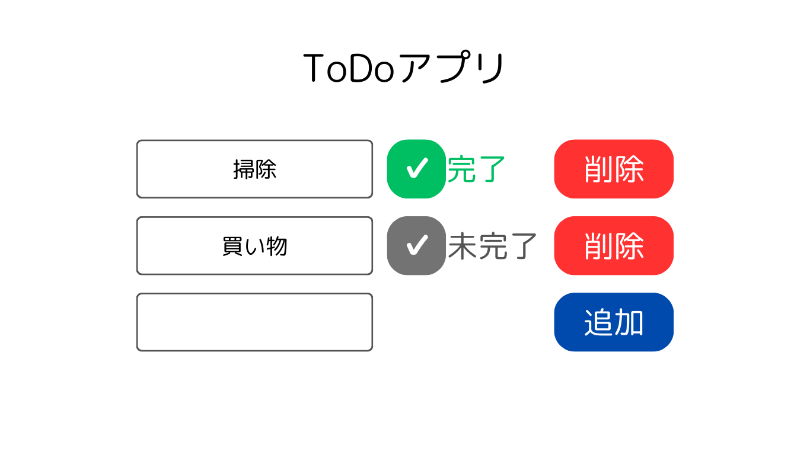

# ToDo app

- [Nuxt 3 Minimal Starter (起動方法)](#nuxt-3-minimal-starter)
	- Node.jsのバージョン18.18.2使用しています。
- [制作メモ](#制作メモ)

## Nuxt 3 Minimal Starter

Look at the [Nuxt 3 documentation](https://nuxt.com/docs/getting-started/introduction) to learn more.

### Setup

Make sure to install the dependencies:

```bash
# npm
npm install

# pnpm
pnpm install

# yarn
yarn install

# bun
bun install
```

### Development Server

Start the development server on `http://localhost:3000`:

```bash
# npm
npm run dev

# pnpm
pnpm run dev

# yarn
yarn dev

# bun
bun run dev
```

### Production

Build the application for production:

```bash
# npm
npm run build

# pnpm
pnpm run build

# yarn
yarn build

# bun
bun run build
```

Locally preview production build:

```bash
# npm
npm run preview

# pnpm
pnpm run preview

# yarn
yarn preview

# bun
bun run preview
```

Check out the [deployment documentation](https://nuxt.com/docs/getting-started/deployment) for more information.

## 制作メモ
### 作業
- デザイン案を考える。


- Nuxt3の動作環境(Node.js - v18.0.0 or newer)に合わせてnode ver 18.18.2をインストール

- nuxtプロジェクトの作成
	- 画面上の指示に従って進める。ついでにtailwind cssもインストールした
```bash
$ npx nuxi@latest init <project-name>
``` 
- tailwind css 公式のガイドに従って設定
- pinia公式ガイドに従ってpiniaをインストール＆設定
- 公式ページや参考ページを見ながらデザイン案に合わせてページを作成
- ページが完成


### 参考ページ
- 参考：Nuxt3で簡単なToDoアプリを作っていく 〜リストレンダリング・イベントハンドリング〜
	- https://qiita.com/nishikor/items/3ca4c42d14edecd5a06f
- 参考：Nuxt3を使ってみる
	- https://zenn.dev/bosushi/scraps/bd416abe14f6a4
- HTML要素リファレンス
	- https://developer.mozilla.org/ja/docs/Web/HTML/Element
- display: noneを使ってCheckboxを実装するのはやめようね。
	- https://qiita.com/Tksn07/items/fe778ed407da1bdc0d69